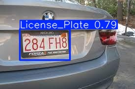

# 🔍 Treinando um Modelo de Visão Computacional com YOLOv11

Este projeto demonstra como treinar um modelo de detecção de objetos usando a arquitetura YOLOv11 em um ambiente Google Colab, com foco em aplicações práticas de visão computacional.

---

## 📌 Visão Geral

A visão computacional é uma área da Inteligência Artificial(AI) que permite que computadores analisem, interpretem e compreendam imagens e vídeos. As aplicações de visão computacional usam AI e Machine Learning(ML) para processar esses dados com precisão para identificar objetos com precisão, realizar classificação, recomendação e detecção. Neste tutorial, exploro a detecção de objetos com a poderosa arquitetura YOLO (You Only Look Once), utilizando sua versão mais recente — YOLOv11.

---

## 🧠 Sobre o YOLO e o YOLOv11

### ⚡ YOLO - You Only Look Once
 
YOLO é um estado da arte de detecção de objetos em tempo real, conhecida por sua velocidade e precisão. Ao contrário de métodos tradicionais, o YOLO realiza a detecção em uma única etapa, o que o torna altamente eficiente. Em outras palavras, o modelo analisa a imagem apenas uma vez e, a partir dessa “única passagem”, é capaz de identificar os objetos presentes, diferente de modelos anteriores, que exigiam múltiplas passagens para processar uma imagem.

### 🚀 YOLOv11

YOLOv11 é uma versão mais recente da arquitetura YOLO, trazendo melhorias em desempenho, arquitetura neural e suporte a novos recursos. Ideal para aplicações em que precisão e tempo de inferência são críticos.

 

---

## 📂 Sobre o Dataset

- **Nome**: License Plate Recognition Computer Vision Project
- **Origem**: [Link](https://universe.roboflow.com/roboflow-universe-projects/license-plate-recognition-rxg4e)
- **Divisão**: Treinamento, validação, teste

---

### 🚀 Etapas

1. Habilitar T4-GPU
2. Instalar o YOLOv11 via Ultralytics
3. Inferência com um modelo Pré-Treinado COCO dataset
4. Universo Roboflow
5. Preparando o dataset
6. Treinamento
7. Validação do treinamento
8. Inferência com o modelo treinado
---
## 🔄 Fases do Processo: Treinamento, Validação e Inferência

Durante o desenvolvimento de um modelo de detecção de objetos, passamos por três fases principais:

### 🎯 Treinamento
Nesta fase, o modelo é exposto ao conjunto de dados de **treinamento**, onde aprende a reconhecer padrões, formas e contextos dos objetos de interesse (neste caso, placas de veículos). A rede ajusta seus pesos internos com base nos erros que comete, tentando melhorar a cada época.

### ✅ Validação
Enquanto o modelo treina, ele é periodicamente avaliado com um conjunto separado de imagens (conjunto de **validação**). Essa fase ajuda a monitorar o desempenho e verificar se o modelo está aprendendo de forma eficaz ou se está começando a memorizar os dados (**overfitting**).

### 🔍 Inferência
Após o treinamento, a **inferência** é o momento de usar o modelo treinado para fazer previsões em novas imagens. Aqui testamos o desempenho real do modelo, muitas vezes utilizando um terceiro subconjunto do dataset (conjunto de **teste**). O objetivo é verificar se o modelo consegue detectar objetos corretamente em imagens que nunca viu.

---

## 🖼️ Exemplo de Resultados

Abaixo, alguns exemplos de detecção realizada pelo modelo treinado:

 

---

## 📚 Referências

- [YOLO Paper](https://arxiv.org/abs/1506.02640)
- [Dataset utilizado](https://universe.roboflow.com/roboflow-universe-projects/license-plate-recognition-rxg4e)
- [Documentação YOLO](https://docs.ultralytics.com)

---

## 🧑‍💻 Autor

Feito por:
**Vinícius Amaro da Rosa** - [Git](https://github.com/ViniciusRosa1) 

